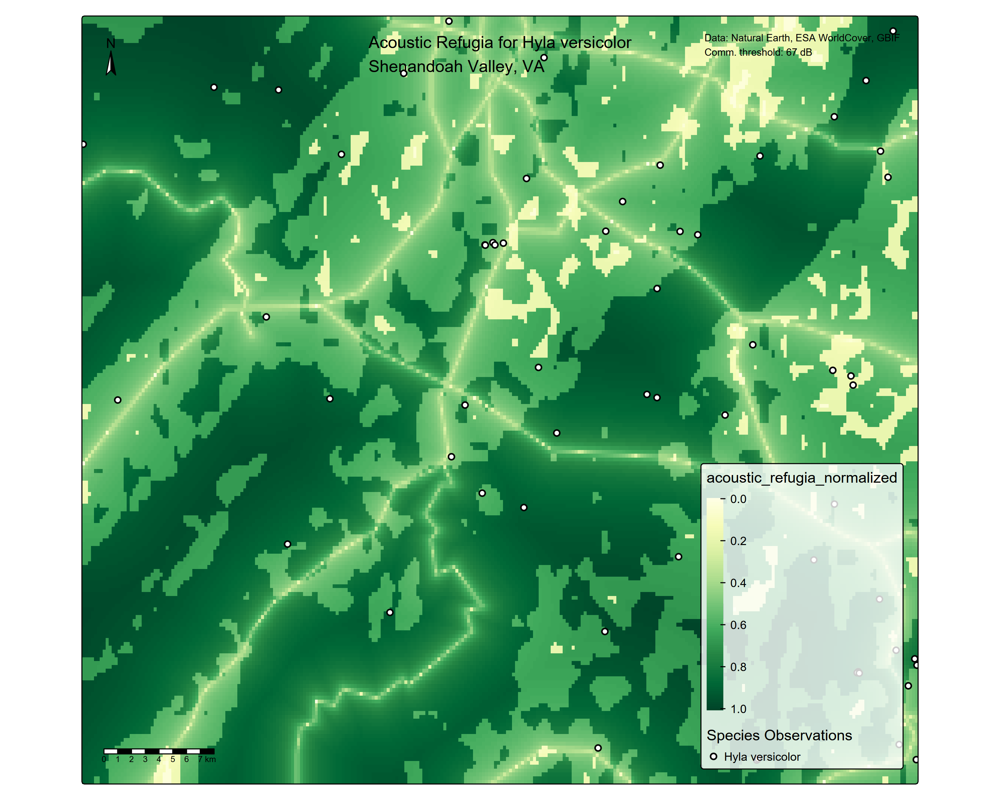

# Acoustic Refugia for Frogs

Mapping where gray treefrogs (*Hyla versicolor*) can effectively 
communicate across noise-polluted landscapes using remote sensing, 
species-specific bioacoustic parameters, and machine learning.

## What this project does

Frogs rely on acoustic signals to attract mates, but anthropogenic 
noise from roads can mask their calls and reduces communication range (Bee & Swanson, 2007). 
This project identifies **acoustic refugia** — areas that are both 
suitable habitat and quiet enough for effective vocal signaling — 
across the Shenandoah Valley, Virginia.

## Key findings

- Noise-related variables (communication range, communication 
  quality) outrank habitat suitability in predicting frog 
  occurrence (Random Forest variable importance analysis)
- The Random Forest model distinguishes occurrence sites from 
  background (median P(occurrence) ~0.65 vs ~0.1) despite weak 
  overall accuracy, outperforming the hand-built refugia index
- Species occurrences are biased toward lower-refugia areas, 
  likely reflecting spatial bias in citizen science data toward 
  human-accessible locations near roads

## Methods

- **Noise:** Modeled from road distance using logarithmic 
  attenuation 
- **Habitat:** Satellite-derived tree cover from ESA WorldCover, 
  reclassified for *H. versicolor* preferences
- **Communication range:** Species-specific call parameters 
  (Gerhardt 1975; Bee & Swanson 2007) with habitat-dependent 
  attenuation caps from empirical data (Schwartz et al. 2016)
- **Validation:** GBIF occurrence records with spatial thinning
- **ML:** Random Forest species distribution model comparing 
  relative importance of noise vs habitat

## Full report

[View the complete analysis with code and figures](https://[username].github.io/frog-acoustic-refugia/)

## Tools

R: terra, sf, tmap, randomForest, caret, rgbif, geodata, viridis, ggplot2

## Author

Lata Kalra| kalra023@umn.edu